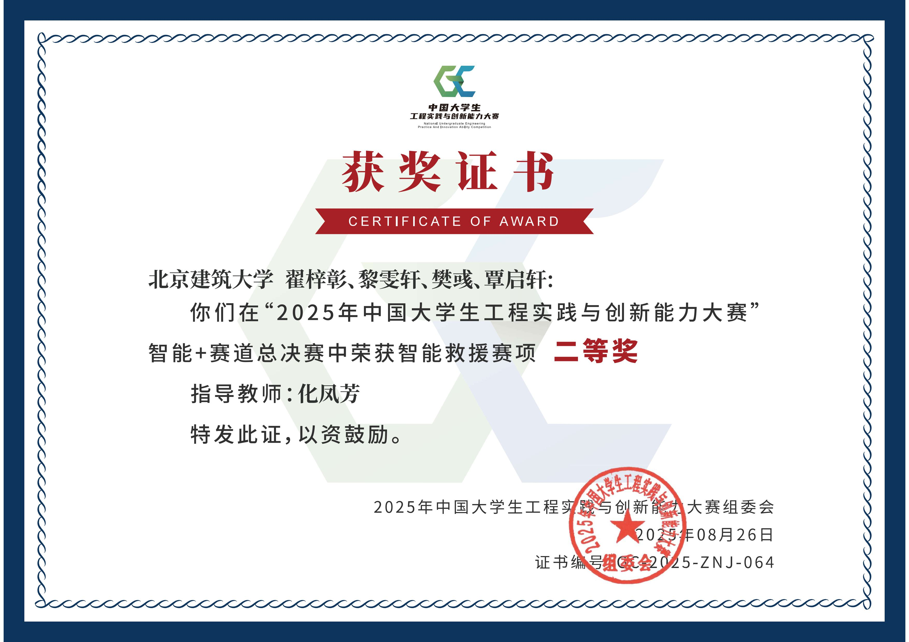

# Intelligent-Rescue-2025 智能救援机器人

> 2025年中国大学生工程实践与创新能力大赛（智能+赛道）智能救援赛项控制系统。

本项目采用 **Jetson (上位机)** + **STM32 (下位机)** 的双核心架构，通过视觉识别与PID控制实现自动搜救任务。

### 🏆 成果展示

| 获奖证书 | 实物展示 |
| :---: | :---: |
|  |  |

---

### 📂 项目目录结构

```plaintext
Intelligent-Rescue-2025/
├── LICENSE                  # MIT 开源许可证
├── README.md                # 项目说明文档
├── Main-Controller/         # 上位机 (Jetson) Python控制程序
│   ├── main.py              # 主程序：有限状态机(FSM)逻辑实现
│   ├── config.py            # 全局配置：队伍参数、阈值、硬件端口
│   ├── control.py           # 运动控制：视觉PID追踪与底盘运动解算
│   ├── uart.py              # 通信模块：自定义协议封包与CRC校验
│   └── vision.py            # 视觉模块：YOLO模型推理、坐标变换与滤波
└── Sub-Controller/          # 下位机 (STM32) C语言固件
    ├── hardware/            # 硬件驱动层
    │   ├── motor.c/h        # 直流电机驱动与增量式PID实现
    │   ├── servo.c/h        # 舵机PWM控制
    │   ├── uart.c/h         # 串口DMA接收与环形缓冲区处理
    │   ├── oled.c/h         # SSD1306 OLED屏幕驱动
    │   └── font.c/h         # 字库文件
    └── system/              # 系统层
        └── callback.c/h     # 定时器中断回调与指令解析执行
```

### ✨ 核心功能

* **视觉巡航**：基于 YOLO 模型实时识别不同颜色的目标球体与安全放置区。
* **智能抓取**：视觉伺服 PID 算法控制底盘精准对正，配合舵机机械爪完成抓取。
* **稳定通信**：自定义 UART 串口协议，确保上下位机指令传输的高效与准确。

---

### 👥 团队信息

**北京建筑大学 工程实践创新中心314工作室**

* **作者**：樊彧、覃启轩
* **开源协议**：MIT License
